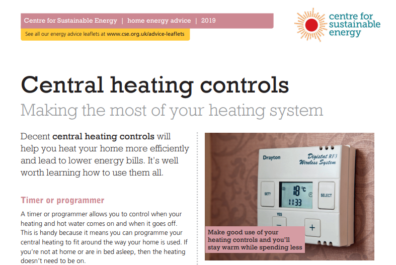

# Thermostatic controls

:TODO: check what Andrew already says

Room thermostats are very misunderstood - whether it's a room thermostat of a thermostatic radiator valve, most people think that if you turn them all the way up, the room will heat up faster. That's not true. They only limit the temperature in the room.  It's a very expensive misconception because the maximum temperature on them is 26C.  One key to energy efficiency is either removing these controls in our spaces or finding a way to limit their use.

- limiter pins in TRVs (can still be broken or removed by determined users, but cheap and better than nothing)

-  but they do provide a very useful function.  They limit the temperature for the room, improving comfort and energy efficiency.  

It's a bad idea to have traditional thermostats and TRVs in community spaces because then users can change the heating settings permanently.  They just fight each other over the settings, break the equipment, and waste energy making themselves comfortable by other means like bringing in space heaters, turning on the oven and all burners on the hob, and propping open the exits with the fire extinguisher.  Instead, they need to have controls where they can 

## A special problem with combining a room stat with TRVs 

We've already said that room thermostats and TRVs both serve to limit the temperature in a room - but they do this in different ways that can cause serious confusion and frustration in community spaces.

Room thermostats are usually wired to turn the boiler off when room temperature is reached.  TRVs just shut off the supply of hot water to an individual radiator.   Installers, who are required to put in energy efficiency controls when they do major works on a system, usually just copy the arrangement they are used to doing in houses.  They put a room thermostat in the principal room and TRVs on all radiators in other rooms.  In a house, that works because it's conventional to keep the sitting room warmer than the other rooms in the house.  Even where it's imperfect, home owners get used to what they have to do to be comfortable.  It doesn't work well in community spaces, especially if users can alter the room thermostat, because one user's behaviour can block other groups from getting heat completely.  

- operate differently - room stat turns the boiler off when the room is warm enough, TRVs just shut off supply of hot water to the one radiator, they can war with each other.

The current building regulations for homes require workers to install heating controls that will make it possible to achieve a level energy efficiency whenever major work is being done on a heating system.  Although there are more modern control arrangements that will satisfy the regulations, the standard approach is to put a room thermostat in one room that the owners like to have relatively warm - usually the sitting room - and thermostatic radiator valves on all radiators in other rooms.  The room thermostat controls whether the system is feeding heat into the radiators, and the thermostatic radiator valves can additionally control the level of heat in that room.  If the sitting room is too warm and another room is too cold, you're out of luck - a TRV can call for heat, but the room thermostat in another room entirely can keep the boiler from providing it.

This control strategy works reasonably well in houses because there aren't many people involved and they spend enough time in the home to find settings that work for them.  The same setup is common in community buildings, but it's terrible for them.

Wireless room thermostats are very popular because running wires from the boiler to the thermostat can be difficult.  Sometimes they are easy to detach from the wall even in community buildings, where it's a good idea to keep all controls bolted down so they don't get lost.  It gets especially confusing if anyone moves them into a room with TRVs.  If the TRV is set lower than the room stat, the heating will run but won't warm the room.

## earlier text

Although the building regulations require heating controls to be put in when a boiler is changed, very few people understand how they work, and waste energy as a result. The Centre for Sustainable Energy has a good factsheet for householders about the most common ones that you can read if you're one of them!  

Here are some of the issues we've observed over the years.

## Temperature setting

Essential problem - if you have mixed user types, some need it warmer than others - Child Care Commission minimum of 16C, dancers often request cooler, older groups or exercise groups sitting on the floor need it pretty warm - but the building doesn't respond very fast if they're on right after each other, AND most controls let groups change the temperature setting permanently, not just for the hour or so that they are in.

The oldest design is timeswitch where you set on/off times and the space air temperature is controlled either via a room thermostat (which can be packaged in the timeswitch or separate) or via TRVs on all radiators in the space.  Common, but not really suitable for community spaces unless all users can live with the same temperature and you have a way to ensure they don't change the thermostat settings (hard covers on the TRVs, lock on the wall thermostat).  TRVs are a particular problem because groups struggle to set them all, and they're only pin and wax, so they aren't very accurate and break easily.

Remember that users almost always turn thermostats to maximum if they're cold because they think the space will heat faster that way.  

Newer designs might be more sophisticated and allow temperatures to be changed just until the next timeswitch

## Wall thermostats

So need tamper proof, and also need clear ways for users to communicate with you if they aren't comfortable, because otherwise they will just remove the covers.  Can use perspex box with a key if desperate.

## Setback "frost" stats

Old-fashioned arrangement, separate frost stat also in main space to make sure it doesn't drop below say 7C; users easily confuse these with room stats and turn them up as far as they can.

## Thermostatic radiator valves (TRVs)

Very, very common misconception that if you turn them up, the room will heat faster. Users wrench them up (older people), down (dancers), around (children) and then they break easily (just wax and pin).  They're really not suitable for spaces where different groups come in frequently; better to remove them and have them all controlled by a single room stat.  In the meantime, depending on your users it may be acceptable to add a limiter or a hard cap that keeps users from changing them.

# Timeswitches

## overrides

Domestic ones almost always have some way of turning the heating on permanently using an "override" until someone remembers to turn it off again - disastrous for energy use in a community building.  They are also almost always designed for young people with good eyesight and steady hands, making it easy to hit the override button accidentally.  

Churches especially often have a recognisable override where some or all building users can access it.  It's very common for volunteers to come into the building for an hour, turn on the heating, and then sometimes leave it on accidentally when they leave.  This is very expensive and usually has no effect on their thermal comfort (except where the system is fast enough to make a radiator warm and they can lean on it - a very expensive alternative to a hot water bottle!) 

You need to think about how people use your buildings, what kinds of overrides they need, and how to get them just those ones.  If the users are only in for short periods, then they should only be able to turn the heating up or down (a bit) 

you're confident you know who will use the building when, then they only 
Possible side bar - Case study of a combi-boiler.  Older model, override button is about the size of a lentil and the heating is on permanently if you hit the button twice instead of once.  The only indication of this was a 3mm icon among many others on a small LCD screen.  :TODO: do we still have pictures?

## Multi-level locks

## Logging